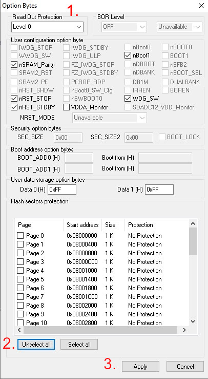

This is open source firmware for the JHEMCU's [8CH Receiver PWM PPM SBUS 32bit Encoder Signal Conversion Module](https://a.aliexpress.com/_mPygQeo).

Module is based on clone of STM32F031K6U6 so firmware can be easily ported to work on similar MCUs.

# preparing
### precompiled binaries
Precompiled binaries can be downloaded from [releases](https://github.com/cruwaller/rc_receiver_to_pwm/releases) page.

### compiling
Platformio is used. Check https://docs.platformio.org/en/latest/core/quickstart.html for more info.

# install
Flash precompiled binaries using [STM32 ST-LINK Utility](https://www.st.com/en/development-tools/stsw-link004.html).

### ST-Link wiring

### Protection disable

**Note** This module uses CSK32F031 clone MCU instead of authentic STM32F031 MCU.
That might cause some failures during the process. Just disconnect and connect again if you face an error :)
You might even need to replug the ST-Link during the process... Just proceed further.

Read and write protections must be disabled prio to programming.
That can be done choosing `Target` -> `Erase Chip` and/or setting options bytes:

### Flashing

Choose `Target` -> `Program & Verify...`. Browse a downloaded bin file and hit start button.

# receiver connection
wiring:
| receiver | PWM Board |
| -------- | --------- |
| TX       | SBUS      |
| Vcc (*)  | Vcc       |
| GND      | GND       |

(*) Make sure you follow receiver's input voltage characteristic!

# Contributors

Special thanks to @arttuy for giving me the HW!
